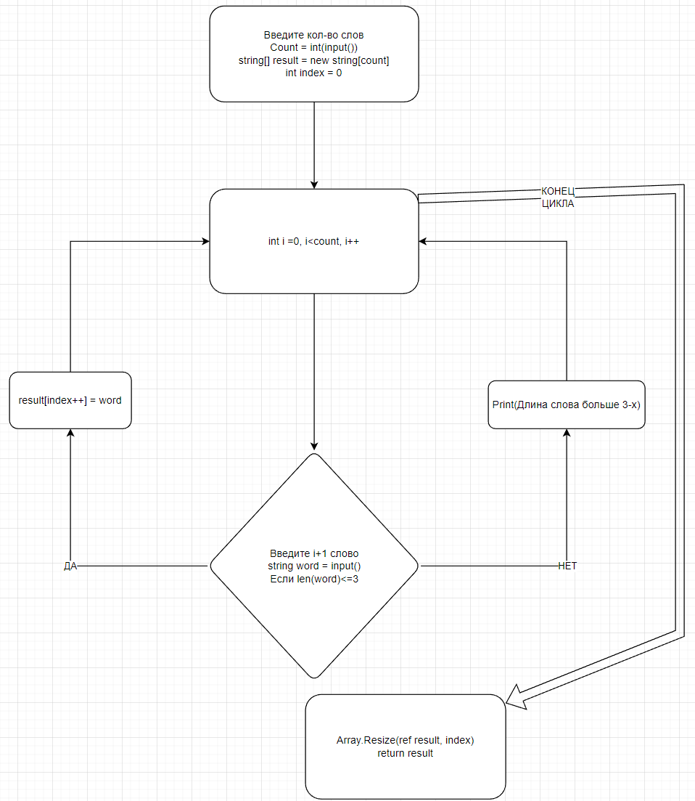

# Описание работы кода и блок схема.

## Console.WriteLine("Введите кол-во слов которые хотите ввести: "); 
- выводится сообщение в консоль с запросом на ввод количества слов, которые пользователь хочет ввести.

## int count = int.Parse(Console.ReadLine()); 
- пользователь вводит количество слов, которые он хочет ввести, и эта строка считывает это значение и преобразует его в целочисленный тип.

## string[] array = GetArrayLess3(count); 
- создается массив строк array, который инициализируется результатом вызова функции GetArrayLess3, которой передается значение count в качестве параметра.

## string[] GetArrayLess3(int size){ 
- объявляется функция GetArrayLess3, которая принимает один параметр size типа int и возвращает массив строк.

## string[] result = new string[size]; 
- создается массив строк result размером size.

## int index = 0; 
- создается переменная index, которая будет использоваться для отслеживания индекса текущего элемента в массиве result.

## for (int i = 0; i < size; i++){ 
- начинается цикл, который будет выполняться size раз, чтобы заполнить массив result.

## Console.WriteLine($"Введите {i+1} слово: "); 
- выводится сообщение в консоль с запросом на ввод следующего слова.

## string word = Console.ReadLine(); 
- пользователь вводит следующее слово, которое считывается в переменную word.

## if (word.Length<=3){ 
- проверяется, имеет ли введенное слово длину, меньшую или равную 3 символам.

## result[index++] = word; 
- если введенное слово имеет длину, меньшую или равную 3 символам, оно добавляется в массив result и значение переменной index увеличивается на 1.

## else { Console.WriteLine($"Длина {i+1} слова больше 3-х: "); } 
- если введенное слово имеет длину, большую 3 символам, выводится сообщение в консоль об этом.

## Array.Resize(ref result, index); 
- изменяется размер массива result до значения index, чтобы удалить ненужные элементы.

## return result; 
- массив result, содержащий все введенные слова, возвращается из функции.

## Console.WriteLine($"[{String.Join(", ", array)}]"); 
- все элементы массива array выводятся в консоль в формате строки, разделенной запятыми, и заключенной в квадратные скобки.

